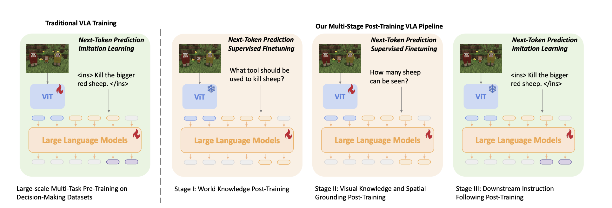

<h1> JARVIS MINECRAFT VLA</h1>

## Abstract

Hey, I'll attempt to rebuild a scaled down version of the Jarvis Minecraft VLA post-training paradimg that was able to get pretty cool output (check out : https://craftjarvis.github.io/JarvisVLA/ ) on some instruction -> action tasks in minecraft (to have seen it all, some task such as cooking, crafting, farming or basic mob killing is kinda ok, but it did NOT slay the enderman which shows the limitations of the VLA) from scratch using the https://arxiv.org/pdf/2503.16365 paper as reference

I will try to update the repo frequently rather than building everything locally and push at then end because why not

## Status

Currently building the data processing helpers and the training loop for phase 2 of post-training

## Base model selection 

The paper uses Qwen2-VL-7B as base VLM model, here one of the two forks I'll make from the paper's implementation will be to pick a more recent base model to hope to get better performance since we'll be post-training on a scaled down version of the model (2nd fork being model size).

Remaining on the Qwen-VL family (instruct versions ofc as we have non thinking trace and don't want crazy latency especially not at inference), and keeping in mind that GPU options on Lambda/Runpod cloud are limited, the best available-ish cards I could find were H100/A100s at 80Gb VRAM, which should allow us to run with Qwen3-VL-2B at bf16 (https://huggingface.co/Qwen/Qwen3-VL-2B-Instruct)

## Datasets 

Thankfully, both for phase 1 and 2 and for phase 3

Phase I/II :  https://huggingface.co/datasets/CraftJarvis/minecraft-vlp (17GB) (this one was hidden/not mentioned on the paper/website)
Phase III : https://huggingface.co/datasets/CraftJarvis/minecraft-vla-sft (106GB)

