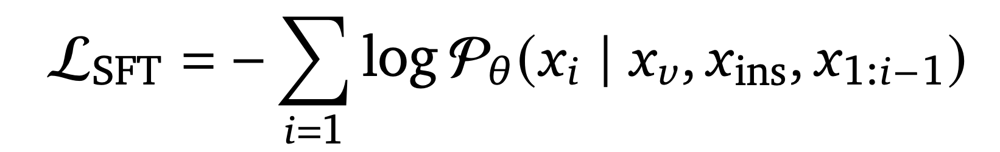
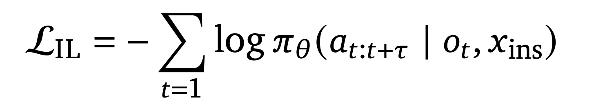
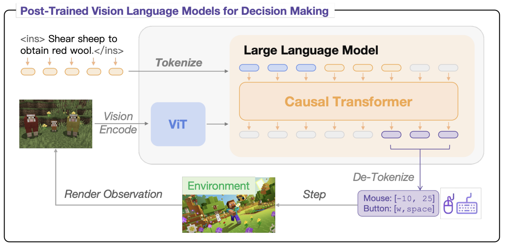
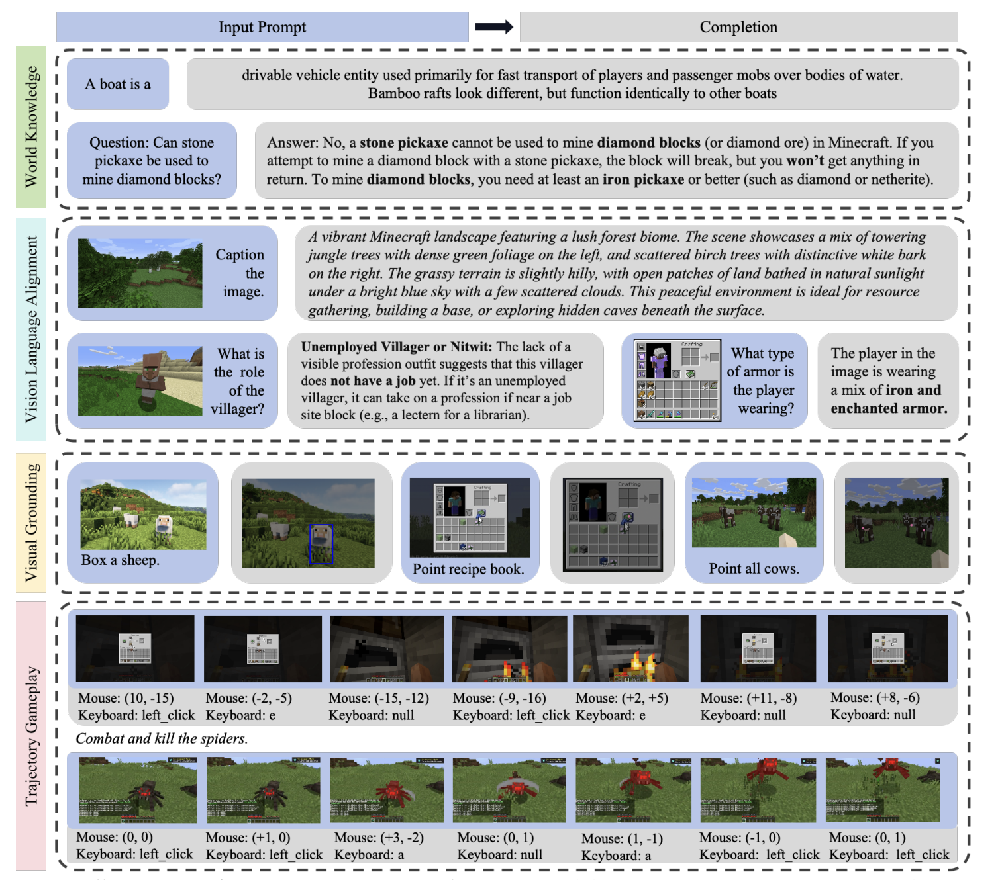
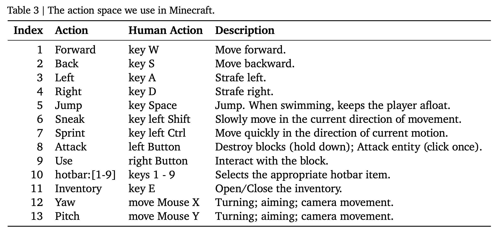
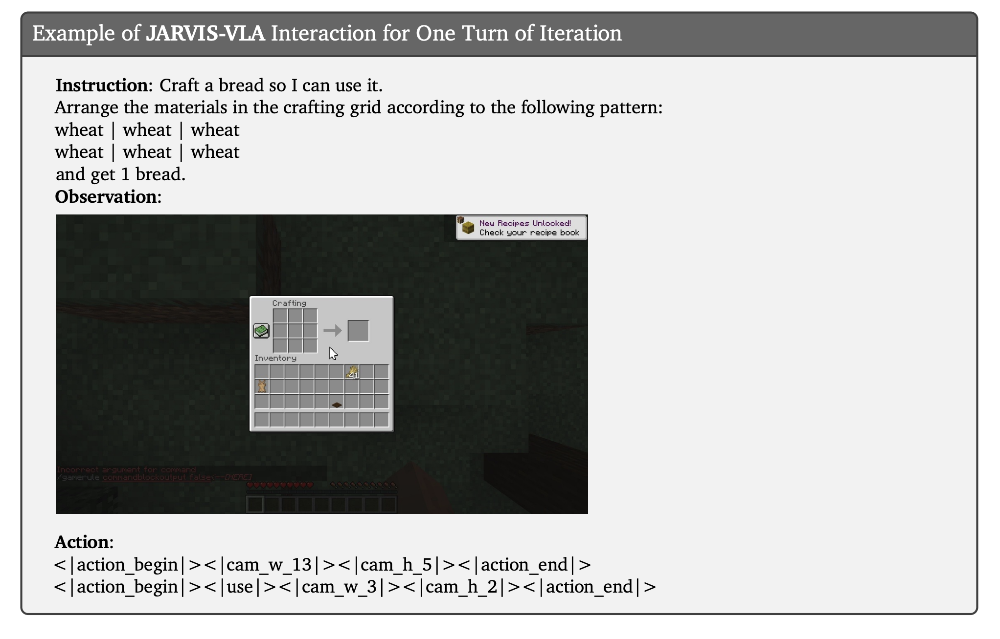

# Notes:

Useful summary of the paper I've built to cache parts I  deemed important for the re-implementation

## Training

### Base model : 

Llava-Next or Qwen2-VL


### Post-training :

<b>ActVLP paradigm:</b>


    Step 1 : World knowledge post-training, frozen ViT, hot LLM, training on regular world knowledge text question with image context tokens from Vit


    Step 2 : Visual knowledge (based on the Vit's embeddings) questions with both Vit and llm hot
             visual question-answering (VQA) with the following training objective
 

(regular GPT next token cross entropy)

     Step 3 : Action post-training, VLM now predicts action tokens which influences the action sequence loop, we train it to predict an action which is a sequence of action tokens At:t+tau in a specific order to product the right action/action sequence, ViT remains frozen



(regular nll over the token sequence)


## Model Structure :

As displayed here :




With one note, the Causal Transformer is not the cross-attention kind, where we run cross attention on the llm's Q embeddings using the Vit's KV cache to compute attention, here, it simply scales the Vit's output embeddings to the llm's dimensionality and appends them at the end of the prompt output (using boundary tokens apparently e.g : <|vision_start|>, <|vision_end|>)
and then runs regular masked self-attention

### Architecture :

```

Image input -> ViT -> Image projection module (simple 2-layer MLP)-------|
                                                                         |
                                                Regular Autoregressive llm  ------> Action Decoder --> Action token (discrete) sequence
                                                                         |
Prompt ---- -------------------------------------------------------------|

```

### Prompt : 

The prompt include the text prompt as well as HISTORY of several previous Images (well their Vit + MLP output tokens) that are crucial for longer horizon tasks/multi-step reasoning

(Since this paper is a year old, we'll try to use better/more recent versions of those and see where it takes us)

### Tokenization :

Instead of re-training the base VLM's tokenizer, we append tokens with the following split :
- 22 mouse control tokens
- 29 keyboard input tokens

! No other modification to the initial VLM's architecture is made which allows us to implement jarvis with a variety of foundational models


## Dataset :

This illustration is highkey enough : 



## Implementation Details :

### Image resolution :

364x644 (H,W)

### VL & Action space Training : 



Optimizer : AdamW with :: B1=0.9 , B2= 0.95, weight_decay=0, eps=1e-8

lr : cosine learning rate w/ warmup, 200 steps of warmup, lr_max = 5e-6 lr_min = 0 

precision : bfloat16 (cuda)

token context-window (prompt + context + image) for Action-language (Phase 3) = 512
token context-window for VL phases (1 and 2) =  3584

for VL post-training, batch size of 2 per device was used with gradient accumulation of 4
!! with 32 GPUs making for either 64-long batches with 4-pass gradient accumulation or a whole 256 batch with no gradient accc

as for the Action post-training 8 batches per device with no gradient acc on every iteration yields again 256 batches on a single gpu
(which we'll most likely mimic through gradient acc I guess since I am NOT renting 32 GPUs)

The exact number of epochs/training steps is not specified anywhere in the paper (we are only given training hours), searching a bit deeper in the repo I was able to find the figure of 1 epoch for Phase 3 (action) but there is highkey nothing about Phase 1 and 2 so we'll have to figure that one out (I think we'll do one epoch)


### Data augmentation startegy :

```
"In the Visual-Language Post-Training phase, modifications included adjustments to hue,
saturation, brightness, contrast, as well as random translation, rotation, slight scaling variations,
shearing, and occasional flipping. These adjustments extended to bounding box and pointing annotations, with necessary masking of instruction-following prompts. In contrast, the Action Post-Training
phase focused on adjusting hue, saturation, brightness, contrast, and translation, applied only on
images."
```

Here, not necessary for us, since I doubt my credit card's ceiling is high enough to create overfiting

### Inference format :

Here is an example of one inference iteration with inputs and desired outputs format :



We want chunks of action tokens that vary in size, as chunking was proven to improve task success and fps ofc
Paper claims that they empirically observed that chunk size of 2 at inference is the optimal pick for efficiency and fps

## Source :

Paper : https://arxiv.org/pdf/2503.16365

Summary : me